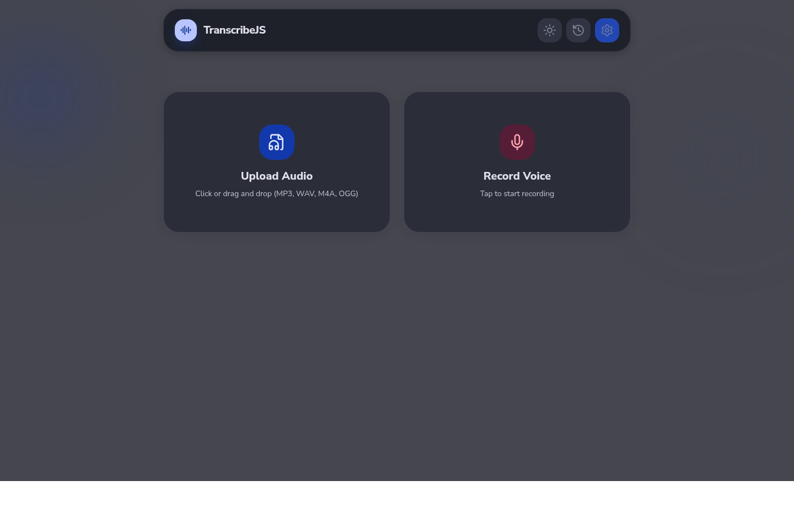
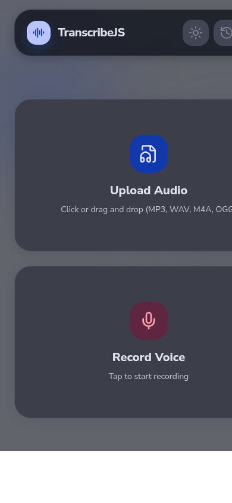

# TranscribeJS

TranscribeJS is an audio transcription app powered by Mistral AI, built with React, TypeScript, and Bun.

## Screenshots

### Desktop (Web)



### Mobile (Web)



## How To Use

1. Open the app (`bun run dev` for web or `bun run dev:tauri` for desktop).
2. Open **Settings** and paste your Mistral API key.
3. Optionally choose a transcription model and source language, then save.
4. Upload an audio file (or drag and drop) or record directly from the microphone.
5. Wait for processing, then review the transcript and export it as `.txt`, `.md`, or `.json`.
6. Use the History panel to review previous transcriptions stored locally.

## Supported Targets

- Linux native desktop app with Tauri v2 (Rust backend, native microphone recording on Linux)
- Android app via Capacitor
- Web app packaged and served with Docker

## Requirements

- Bun v1.3+
- Rust toolchain (for Tauri)
- Tauri v2 Linux system dependencies
- Android Studio + Android SDK (for Android builds)
- Docker (for containerized web app)

## Commands

| Action | Command | Description |
| :--- | :--- | :--- |
| **Install** | `bun install` | Install dependencies. |
| **Dev (Web)** | `bun run dev` | Start web dev server with hot reload. |
| **Build (Web)** | `bun run build` | Build web assets into `dist/`. |
| **Dev (Tauri)** | `bun run dev:tauri` | Start Tauri dev environment. |
| **Build (Tauri)** | `bun run build:tauri` | Build Linux native Tauri app. |
| **Android Sync** | `bun run cap:sync` | Build web assets and sync Android project. |
| **Android Dev** | `bun run cap:android` | Sync and open Android Studio project. |
| **Tests** | `bun test` | Run Bun test suite. |

## Docker Web App

Build and run the web app container:

```bash
docker build -t transcribejs:web .
docker run --rm -p 3000:3000 transcribejs:web
```

The app will be available at `http://localhost:3000`.

## Arch Linux Packaging

Build and install the native package:

```bash
makepkg -si
```

## Project Structure

- `src/`: React app
- `src/services/`: audio processing + Mistral client
- `src-tauri/`: Tauri Rust backend and config
- `android/`: Capacitor Android project
- `dist/`: generated web build output
- `build.ts`: web build script
- `dev.ts`: web dev server
- `Dockerfile`: web app container build
